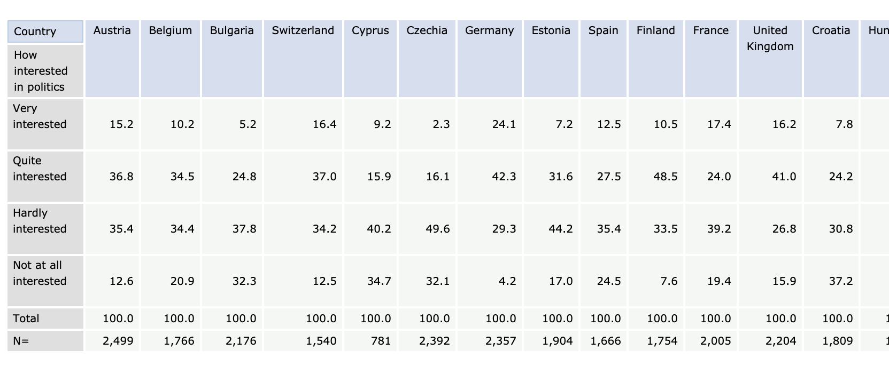

# European Social Survey Data

<https://www.europeansocialsurvey.org/>

The European Social Survey (ESS) collects survey data on social attitudes across over
30 European nations.

It is used to track how attitudes have changed over time and how they vary between countries in Europe. A typical example of a question is the following:

How confident are you in your own ability to
participate in politics?

Not at all confident  1

A little confident    2

Quite confident       3

Very confident        4 

Completely confident  5

(Refusal)             7

(Don’t know)          8.

The survey runs every two years and the first one was conducted in 2002. As of now, 9 rounds have been completed, the most recent one took place in 2018.
A list of participating countries can be found [here](https://www.europeansocialsurvey.org/about/participating_countries.html).

All the data is freely available for non-commercial use. You just have to do a quick email registration. I'll get into that in a bit.

## Methodology

- The survey uses random probability sampling. 

- The fieldwork is conducted face to face by interviewers and it lasts approximately an hour. It is conducted in the local language and it is mainly computer-assisted.

- Questionnaires are translated for *functional equivalence*. That is, they are translated in such a way that the questions mean the same in every single country. This is in contrast to the questions being only *literally equivalent*. The source questionnaire is written in English, then local experts translate that questionnaire, so it has the same meaning in every country as the English original (as far as that is possible).

- There is a very strong focus on standardizing the data collection and interviewing process. This is done through training. The sampling procedure must be random probability sampling. Lots of interviewer instructions and training is given in order to standardize their approach in terms of asking the question exactly as they appear in the questionnaire and not paraphrasing or interpreting the questions for respondents. 

- Response maximisation. Making sure the response rate is as high as possible.

- Consistent data format across all countries. So the variables under consideration are in exactly the same format across different countries.

## Questionnaire

Core topics in all rounds

- crime
- democracy and politics
- human values
- immigration
- media use
- national and ethnic identity
- perceived discrimination
- religion
- social exclusion
- social trust/trust in institutions
- subjective wellbeing
- socio-demographics

## How to use and access the data

On the European Social Survey website, you will find the online analysis tool under Data and Documentation. The online analysis tool is run by the Norwegian Centre for Research Data (NSD). 

Say we want to find out how interested people were in politics across various European countries in the year 2018. Proceed as follows:

1. Click on ESS9-2018. Click the plus sign next to Variable Description. Now click on TABULATION, where you will be presented with an empty table.

2. Under Variable Description, click on Politics and then click on How interested in Politics and a little box will appear with the options Add to row, Add to column, Use as filter and Add as measure. We will choose Add to row. You will be asked to register yourself. After you have completed the registration you will see the following table. 

3. But this table shows the result for all of Europe, so we are going add the variable Country to 
column. Now you will see the following table. 

4. The data is still unweighted. You need to add weights. At the top right next to ANALYSIS, you will see a scale symbol ⚖️, if you hover over it, the word weight appears. Click on it! A dialogue box will appear. Let's take a short detour to learn about weighting your data.

## Weighting your data

We usually need to weight data to 'correct' the profile of the respondents so it reflects the population.

On ESS there are three different types of weights:

- **Design weight**. This is correcting for the fact that some people have a higher chance of being surveyed than others. By random probability sampling we randomly select the addresses and send the interviewers to those addresses and if there is more than one person at that address the interviewer has to make a random choice. What that means is that people in single person households will automatically get chosen and people in households where there is more than one person have a lower chance of being selected. The design weight simply corrects for that.

- **Post-stratification weight** (includes design weight). This calibrates the sample to population estimates. It forces the sample to be representative of the population we are interested in. On ESS it does this in terms of age, sex, region and also in some countries in terms of education attainment. For example, most surveys tend to underrepresent younger people. Younger people are less likely to take part in surveys. So the post stratification weight corrects for that.

- **Population size weight**. This corrects for population size when combining two more or more countries. Germany has a much greater population than Belgium but the number of participants in the surveys conducted in each country are similar. So if we add them together without weighting, that would mean that Belgian respondents have an equal share compared to the German respondents. So we need to correct for that.

So which weight should you use?

In most cases you will use one of two weights:

- When you are looking at a single country in isolation, use the Post-stratification weight.

- When you are looking at two or more countries' data together, we need to in addition use the population weights. This is called the **analysis weight**. 

##

Now back to the dialogue boxes.

5. Add the analysis weight to the right dialogue box and click ok. Now you will get a weighted table. 

You'll notice that below the table there is a scale icon ⚖️, right next to which it says weight is on. You will also notice that N is now larger for countries with higher population. If we took the weight off, we will see similar numbers for N across different European countries.

By clicking on the floppy disc icon at the top right, you can download the data in various file formats. You can also visualize the data by clicking on the bar chart icon.

Suppose we want to find out how interested young people are in politics. We can do this by filtering the data. Click on the funnel icon at the top right. A dialogue box comes up. Under Gender, Year of birth and Household grid, you will find the variable Age of respondent, calculate. Click on it and then click on Add to subset. Then add 35 to value and choose the logical operator <=. Click ok! You will see a table under which it say the filter is on and the weights are on.

If you want to do a much more substantial analysis yourself, instead of using the online analysis tool, check out the Data and Documentation section of the European Social Survey website.

The list of questions asked can be found under Data and Documentation by Round/Year. Also check out the data protocol, it tells you how the data is structured. This is very important for data analysts.

**References**

- 9th May 2018. Webinar: Introduction to accessing and using European Social Survey data. UK Data Service. 

